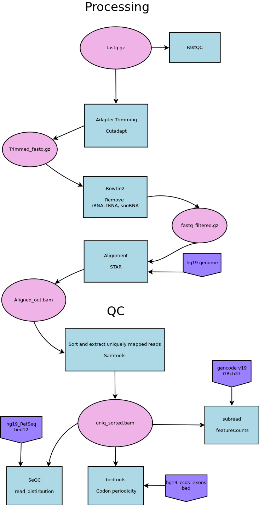

# PEC RiboSeq Pipeline

Pipeline to process RiboSeq data


This pipeline requires the __"ChunkyPipes <https://github.com/djf604/chunky-pipes>"__ pipeline framework and will not run self-contained.

The ChunkyPipes framework can be easily installed with::

    $ pip install chunkypipes
    
 These pipelines can be installed, configured for the current platform, and run with::
    
    $ chunky install pipeline-name.py
    $ chunky configure pipeline-name
    $ chunky run pipeline-name [parameters]
               
 For more information on running these pipeline with ChunkyPipes, please refer to the
 `ChunkyPipes documentation <http://chunky-pipes.readthedocs.io>`
                
For questions about this pipeline, please contact Thomas Goodman (tgoodman dot uchicago at gmail dot com)


### 1.0 Pipeline Overview



Platform Information:
Platform | IGSB PDC
Name | RiboSeq
Operating System | Ubuntu 14.04 LTS (Linux)
CPUs | 8 - 32
RAM | 32 - 62 GB
Python version | 2.7.6

### 2.1 Trim Raw Data for Adapters and Quality
#### Cutadapt

```
cutadapt -a AGATCGGAAGAGCACACGTCT --quality-base=33 --minimum-length=25 --discard-untrimmed --output={filename}.trimmed.fastq.gz {filename}.fastq.gz> > {filename}_cutadapt.summary.log.txt
```
Parameters/Arguments:
-a | Forward adapter sequence
--quality-base | '33' for phred33 or '64' for phred64
--minimum-length | Discards trimmed reads shorter than given length
--discard-untrimmed | Discards reads without adapters
--output | Path to file output

Program Information:
Input | Raw `.fastq` file
Output | Trimmed `.trimmed.fastq` file
Version | 1.13
Source | Compiled from source

Notes:
* Full documentation for Cutadapt is available [here](http://cutadapt.readthedocs.org/en/latest/guide.html).

### 2.2 Align fastq to rRNA, tRNA, and snoRNA reference to remove them from the trimmed fastq. Keep mRna for alignment
#### Bowtie2

```
bowtie2 --seedlen=23 --threads 32 --un-gz={filename}_filtered.fq -x {genome} -U {filename}.trimmed.fastq.gz {filename}.rts.sam -S > {filename}.bowtie2.log 2> {filename}.bowtie2.log2
```
Parameters/Arguments:
--seedlen | 
--threads | Number of threads to run
--un-gz | Output file for Unaligned sequences, to be gzipped
--x | Genome reference
-U | Input trimmed fastq file
-S | File to write SAM alignments to

Program Information:
Input | Trimmed `.fastq` file
Output | Trimmed `_filtered.fastq` file
Version | version 2.2.9
Source | Compiled from source

Notes:
* Full documentation for Bowtie2 is available [here](http://bowtie-bio.sourceforge.net/bowtie2/manual.shtml).

### 2.3 STAR align kept reads to genome
#### STAR

```
STAR --runThreadN 32 --sjdbGTFfile gtfFile --outSAMtype  BAM Unsorted --outFileNamePrefix {filename}_ --genomeDir /path/to/genome/index --genomeFastaFiles --readFilesIn {filename}_filtered.fq.gz --readFilesCommand zcat
```
Parameters/Arguments:
--runThreadN | Number of threads
--sjdbGTFfile | gtf reference file
--outSAMtype | Formant for output alignment file (bam unsorted)
--outFileNamePrefix | Prefix for output filename
--genomeDir | a STAR genome index
--readFilesIn | input fastq file
--readFilesCommand zcat | read a gzipped file

Program Information:
Input | mRNA fastq `_filtered.fq.gz` file
Output | Alignment `_Aligned.out.bam`
Version | STAR_2.5.3a
Source | Compiled from source

Notes:
* Full documentation for STAR is available [here](https://github.com/alexdobin/STAR/blob/master/doc/STARmanual.pdf).

### 2.4 Sort and extract uniquely mapped reads for QC and further analyses
#### Samtools

```
samtools view -H {filename}_Aligned.out.bam > header.sam 
samtools view {filename}_Aligned.out.bam | grep -w NH:i:1 | cat header.sam - | samtools view -bS - | samtools sort - ${filename}.uniq_sorted
```
Parameters/Arguments:
-H | View header of file
-b | output in bam format
-S | Previously this option was required if input was in SAM format, but now the correct format is automatically detected

Program Information:
Input | {filename}_Aligned.out.bam
Output | {filename}.uniq_sorted.bam
Version | 1.4
Source | Compiled from source

Notes:
* Full documentation for samtools is available [here](https://github.com/alexdobin/STAR/blob/master/doc/STARmanual.pdf).

### 2.5 evaluate percent reads mapped to each genomic features
#### SeQC - read_distribution.py

```
read_distribution.py -r hg19_RefSeq.bed12 -i {filename}.uniq_sorted.bam > {filename}.read_distribution.log
```
Parameters/Arguments:
-r | reference file
-i | input bam

Program Information:
Input | {filename}.uniq_sorted.bam
Output | {filename}.read_distribution.log
Version | read_distribution.py 2.6.4
Source | Compiled from source

Notes:
* Full documentation for read_distribution.py is available [here](http://rseqc.sourceforge.net/#read-distribution-py).

### 2.6 Create Codon periodicity charts
#### Bedtools - intersect

```
bedtools intersect -a hg19_ccds_exons_plus_start100.bed -b {filename}.uniq_sorted.bam -s -bed -wa -wb > intersect_start100
awk -v OFS='\t' '{print ($2-($14+100))}' {filename}_intersect_start100.bed | sort | uniq -c > {filename}_relative_pos_aggregate.table
```
Parameters/Arguments:
-a | Annotation to be used. 
-b | input bam
-s | Force “strandedness”. That is, only report hits in B that overlap A on the same strand
-bed | When using BAM input, write output as BED. 
-wa | Write the original entry in A for each overlap.
-wb | Write the original entry in B for each overlap. Useful for knowing what A overlaps. Restricted by -f and -r.

Program Information:
Input | {filename}.uniq_sorted.out.bam
Output | {filename}.intersect_start100.bed, {filename}_relative_pos_aggregate.table
Version | v2.25.0
Source | Compiled from source

Notes:
* Full documentation for bedtools intersect is available [here](http://bedtools.readthedocs.io/en/latest/content/tools/intersect.html).

### 2.7 Read counting
#### subread: featureCounts

```
featureCounts -a gencode.v19.annotation.gtf -o {filename}.featureCounts -s 1 {filename}.uniq_sorted.bam
```
Parameters/Arguments:
-a | Annotation to be used. 
-o | output name
-s | Strand specific read counting

Program Information:
Input | Bam file {filename}.uniq_sorted.bam
Output | Log file {filename}.featureCounts
Version | 1.5.2
Source | Compiled from source

Notes:
* Full documentation for featureCounts intersect is available [here](http://bioinf.wehi.edu.au/subread-package/SubreadUsersGuide.pdf).

### 2.8 FastQC

```
fastqc --outdir={filename} --t {filename}.fastq.gz
```
Parameters/Arguments:
--outdir | where to put
--t | number of threads

Program Information:
Input | Fastq {filename}.fastq
Output | Directory of QC information
Version | v0.11.5
Source | Compiled from source

Notes:
* Full documentation for FastQC intersect is available [here](https://www.bioinformatics.babraham.ac.uk/projects/fastqc/Help/).
